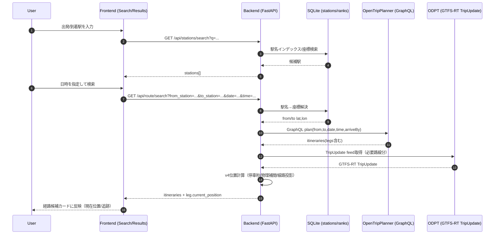

## 1. プロジェクト概要

- **システム名**: **NowTrain**（`README.md` より）
- **目的**: **JR東日本の電車位置をリアルタイムに可視化し、経路検索（OTP）と「乗車予定列車の追跡（My Train）」を統合したWebナビを提供する。**

### アーキテクチャ図（Mermaid）

```mermaid
flowchart LR
  U[User Browser] -->|HTTPS| FE[Frontend: React + Vite]
  FE -->|/api/* (Vite proxy)| BE[Backend: FastAPI (Uvicorn)]
  FE -->|Map tiles / styles| MB[Mapbox API]

  BE -->|GTFS-RT fetch| ODPT[ODPT API (JR-East GTFS-RT)]
  BE -->|GraphQL plan| OTP[OpenTripPlanner 2.5 (Docker)]
  BE -->|SQLite| DB[(nowtrain.db)]
  BE -->|Static JSON load| DATA[(mini-tokyo-3d JSON)]
```

### 技術スタック

- **Backend**
  - Python 3.11
  - FastAPI / Uvicorn
  - httpx（非同期HTTPクライアント）
  - GTFS Realtime bindings（`gtfs-realtime-bindings`）
  - SQLAlchemy + SQLite（駅情報・駅ランク）
  - python-dotenv（.env）
  - Sentry（`sentry-sdk[fastapi]`）
- **Frontend**
  - React（Vite）
  - react-router-dom
  - mapbox-gl（地図表示）
  - Sentry（@sentry/react）
  - テスト: Vitest / Testing Library、E2E: Playwright
- **Infra/CI**
  - GitHub Actions（Backend: ruff + pytest / Frontend: eslint + vitest + build / E2E: Playwright）
  - Docker Compose（OpenTripPlanner 2.5.0）

---

## 2. ディレクトリ構成と責務

> ※入力は “全ソース結合テキスト” のため、代表的な主要ファイルのみ抜粋してツリー化しています。

```text
.
├─ docker-compose.yml                 # OTP(2.5.0) 起動用
├─ .github/workflows/ci.yml           # CI: backend/frontend/e2e
├─ backend/
│  ├─ main.py                         # FastAPIエントリ・API定義・統合ロジック
│  ├─ config.py                       # サポート路線定義（line_id→GTFS/MT3D ID）
│  ├─ constants.py                    # ODPTのURL、service_type定数、timeoutなど
│  ├─ data_cache.py                   # 静的データ/DBデータのロード&インデックス
│  ├─ database.py                     # SQLite/SQLAlchemyモデル（Station/StationRank）
│  ├─ import_data.py                  # stations.json → DB取り込み、駅ランク初期投入
│  ├─ otp_client.py                   # OTP GraphQLクライアント + レスポンス正規化
│  ├─ gtfs_rt_tripupdate.py           # TripUpdate取得→列車スケジュール推定（MS1）
│  ├─ gtfs_rt_vehicle.py              # VehiclePosition系（旧/補助）
│  ├─ train_position_v4.py            # TripUpdate-only 位置計算（物理補間/停車/進捗）
│  ├─ geometry.py                     # 線路座標のキャッシュ化・sublines結合
│  ├─ time_manager.py                 # 仮想時刻（タイムトラベル）管理
│  ├─ station_ranks.py                # 駅ランク→停車秒の既定値
│  └─ tests/                          # pytest系（路線/データ整合のテスト）
└─ frontend/
   ├─ vite.config.js                  # /api → http://localhost:8000 proxy
   ├─ package.json                    # React + Mapbox GL + Router + test tooling
   ├─ public/data/mini-tokyo-3d/      # 静的データ（railways/stations/coordinates等）
   └─ src/
      ├─ main.jsx / App.jsx           # ルート・画面コンテナ
      ├─ api/serverData.js            # backend API 呼び出し（経路検索/駅検索など）
      ├─ api/staticData.js            # 静的JSON & backend経由取得（shapes/stations）
      ├─ components/
      │  ├─ MapView.jsx               # Mapbox地図、列車描画、ポーリング、MyTrain
      │  ├─ SearchScreen.jsx          # 経路検索（駅名入力）
      │  ├─ ResultsScreen.jsx         # 経路候補一覧
      │  ├─ NavigationScreen.jsx      # ナビ（経路+列車追跡の統合表示）
      │  ├─ RouteSearchPanel.jsx      # 入力UI（日時/駅/到着時刻指定など）
      │  └─ AdminPanel.jsx            # 駅ランク更新UI（推定）
      └─ utils/trainUtils.js          # 列車ID同定/番号抽出等
```

---

## 3. バックエンド詳細仕様 (FastAPI)

### 3.1 起動・ライフサイクル

- `startup`:
  - `DataCache.load_all()` により、静的JSON（MiniTokyo3D）＋DB（stations/ranks）を読み込み
  - `httpx.AsyncClient` を `app.state.http_client` に保持（GTFS-RT/OTP用）
  - `VIRTUAL_TIME` があれば `TimeManager` を仮想時刻モードに設定
- `shutdown`:
  - `httpx.AsyncClient` をクローズ

### 3.2 APIエンドポイント一覧

| Method | Path | 概要 | Request | Response（概略） | 依存する外部API |
| --- | --- | --- | --- | --- | --- |
| GET | `/api/health` | ヘルスチェック | - | `{status:"ok"}` | - |
| GET | `/api/lines` | 路線一覧（事業者フィルタ可） | `operator?` | `{lines:[...]}` | - |
| GET | `/api/lines/{line_id}` | 路線詳細（ID解決あり） | path | `{id,title,stations,...}` | - |
| GET | `/api/stations` | 路線に属する駅一覧（DB） | `lineId` or `line_id` | `{stations:[...]}` | - |
| GET | `/api/stations/search` | 駅名部分一致検索（DBインデックス） | `q, limit` | `{query,count,stations:[...]}` | - |
| PUT | `/api/stations/{station_id}/rank` | 駅ランク/停車秒の更新（DB） | body: `{rank,dwell_time}` | `{station_id,rank,dwell_time}` | - |
| GET | `/api/shapes` | 路線の線路形状をGeoJSONで返す（ID解決あり） | `lineId` or `line_id` | `FeatureCollection` | - |
| GET | `/api/trains/yamanote/positions` | 旧: 山手線列車位置（VehiclePosition系） | - | `{timestamp,trains:[...]}` | ODPT |
| GET | `/api/trains/yamanote/positions/v2` | 旧: 出発時刻付き | - | `{timestamp,count,trains:[...]}` | ODPT |
| GET | `/api/trains/yamanote/positions/v4` | **v4: TripUpdate-only 位置計算（山手線）** | - | `{timestamp,source,positions:[...]}` | ODPT（or Mock） |
| GET | `/api/trains/{line_id}/positions/v4` | **v4: 汎用路線の列車位置** | path | `{timestamp,source,positions:[...]}` | ODPT（or Mock） |
| POST | `/api/debug/time-travel` | 仮想時刻の設定/解除 | `{virtual_time: string|null}` | `{status,message,...status}` | - |
| GET | `/api/debug/time-status` | 時刻モード取得 | - | `{virtual,offset_sec,now,...}` | - |
| GET | `/api/route/search` | **OTP経路検索 + 各電車区間へ現在位置を付加** | query（駅名 or 座標 + date/time/arrive_by） | `{status,query,itineraries:[...]}` | OTP + ODPT |
| GET | `/api/debug/*` | TripUpdate/route_id/stop_id等の検証 | - | debug JSON | ODPT |

> **重要**: v4系が本命の列車位置APIで、Route Search もここを統合利用します（My Trainもv4ポーリング）。

---

### 3.3 データモデル

#### (1) DBモデル（SQLite）

- `stations`
  - `id: str`（MT3Dの station id）
  - `line_id: str`（stations.json の railway を単一路線として格納）
  - `name_ja, name_en: str?`
  - `lat, lon: float?`
- `station_ranks`
  - `station_id: str`（FK stations.id）
  - `rank: str`（`S/A/B`）
  - `dwell_time: int`（停車秒）

#### (2) リクエストモデル（Pydantic）

- `StationRankUpdate`
  - `rank: "S"|"A"|"B"`
  - `dwell_time: int`（0以上）
  - バリデーション:
    - `dwell_time < 0` は 400
    - `rank` が `S/A/B` 以外は 400

#### (3) ドメイン（dataclass中心）

- `timetable_models.py`
  - `StopTime(station_id, arrival_sec?, departure_sec?)`
  - `TimetableTrain(base_id, service_type, line_id, number, train_type, direction, destination_stations, stops...)`
  - **service_type 推定**: `id` の末尾から推定し、該当しない場合 `Unknown`
  - **destination_stations**: 明示値がなければ、最終stopを終着として補完
- `train_position_v4.py`
  - `SegmentProgress`（前駅/次駅、時刻、進捗、停車/走行など）
  - 返却用 `positions` は（概念的に）以下を含む:
    - `trip_id / train_number / direction / line_id`
    - `prev_station_id / next_station_id`
    - `progress(0-1)` と `lon/lat`
    - `is_stopped`, `delay_seconds`, `data_quality` 等

---

### 3.4 主要ロジック（Reverse Engineering）

#### A. 静的データの読み込み（DataCache）

- `mini-tokyo-3d/railways.json` と `coordinates.json` を読み込み
- `train-timetables/*.json` を複数ロードし、全路線分 `TimetableTrain` に変換
- DBから駅座標・駅ランクをロードし、検索/位置計算用のインデックスを構築
- 駅名検索インデックス（日本語/英語）を構築  
  → `GET /api/stations/search` で利用

#### B. ID解決（“隠れ仕様”）

- フロントは `lineId=yamanote` のような短いIDを使う
- バックは `config.SUPPORTED_LINES` により **短いID→MT3D/GTFSの正式ID** に解決する  
  例: `chuo_rapid -> JR-East.ChuoRapid`
- これにより、フロントがデータ形式差（OTP route_id、MT3D id）を意識しない設計になっている

#### C. 線路形状（Shapes）

- `coordinates.json` の `railways[].sublines[].coords` を統合して LineString を生成
- 複数サブラインの結合ロジックがあり、失敗時のフォールバックも実装（`merge_sublines_v2 / merge_sublines_fallback`）
- 返却は GeoJSON FeatureCollection（フロントがそのまま描画可能）

#### D. 列車位置 v4（TripUpdate-only + 物理補間）

- ODPTの **GTFS-RT TripUpdate** から「列車の駅間進行状況」を推定し、線路形状上の座標へ投影
- **停車時間**は駅ランクにより変動（S/A/B）  
  - 既定値（例）: S=50秒, A=35秒, B=20秒（`station_ranks.py`）
  - 管理画面からDB更新可能（`PUT /api/stations/{station_id}/rank`）
- **物理演算ベース補間（E235想定）**:
  - 台形速度制御の近似で progress を算出（加速/定速/減速）
  - 例: 加速30秒・減速25秒を基準に総所要時間へスケール
- **タイムトラベル（モック）**:
  - `TimeManager` が仮想時刻モードなら、ODPTではなくモックTripUpdateを生成して返す
  - デバッグ・デモ・E2Eに有効

#### E. 経路検索（OTP統合）

- `GET /api/route/search`
  - 入力は **座標指定** or **駅名指定**（駅名はDBインデックスで座標へ解決）
  - OTP GraphQL `plan` を叩いて itinerary を得る（徒歩のみは除外）
  - itinerary の各 transit leg について
    - `route.gtfsId` → 対象路線を推定（内部マッピング）
    - 必要な路線の v4列車位置をまとめて取得
    - `leg.trip_id` の suffix 抽出で TripUpdate 側の `trip_id` と突合し、`current_position` を付与

---

## 4. フロントエンド詳細仕様 (React)

### 4.1 画面構成と遷移（概念）

- **SearchScreen**
  - 出発駅/到着駅（サジェスト付き）、日時、到着時刻指定
  - `/api/stations/search` を叩き候補表示
  - `/api/route/search` を実行し Results へ
- **ResultsScreen**
  - itinerary（経路候補カード）一覧
  - 選択した経路で Navigation へ
- **NavigationScreen**
  - 地図（MapView）上に経路ハイライト
  - 使用列車の現在位置（leg.current_position）と MyTrain の統合表示
- **MapView**
  - Mapbox GL による地図描画
  - 路線shape描画、列車マーカー描画
  - 2秒ごとの列車位置ポーリング（MyTrain時は複数路線並列）
- **AdminPanel（推定）**
  - 駅ランク/停車秒を更新（`PUT /api/stations/{station_id}/rank`）

### 4.2 主要コンポーネント

#### MapView.jsx

- **責務**
  - Mapbox初期化、レイヤ追加
  - 選択路線の shapes/stations をロードして描画
  - 列車位置を定期取得してアニメーション/補間表示
  - **My Train**: 乗車予定列車を特定して強調表示
- **状態（例）**
  - `selectedLineId`, `stations`, `shapes`
  - `trainPositions`（v4 positions）
  - `myTrainIds`（追跡対象の trip/train 識別子）
- **外部依存**
  - Mapbox token: `VITE_MAPBOX_ACCESS_TOKEN`

#### RouteSearchPanel.jsx / SearchScreen.jsx

- `/api/stations/search` で駅候補を取得
- `/api/route/search` 実行時パラメータ:
  - `from_station`, `to_station`, `date`, `time`, `arrive_by`

### 4.3 APIクライアント

- `src/api/serverData.js`
  - `searchStations(query, limit)` → `/api/stations/search`
  - `searchRoute(params)` → `/api/route/search`
- `src/api/staticData.js`
  - ローカルJSON読み込み（railways/stations/coordinates）
  - ただし stations/shapes/line detail は **バックエンド経由**が主（ID解決のため）

---

## 5. データフロー図 (Sequence Diagram)

### ユースケース: 「駅名で検索 → 経路候補表示 → 各列車区間に現在位置が付与される」



---

## 6. インフラ・CI/CD・設定

### 6.1 環境変数 (.env)

#### Backend (`backend/.env`)

| Key | 役割 |
| --- | --- |
| `ODPT_API_KEY` | ODPT（GTFS-RT）アクセスキー（必須: リアルタイム） |
| `FRONTEND_URL` | CORS許可オリジン（例: `http://localhost:5173`） |
| `SENTRY_DSN` | Sentry送信先（任意） |
| `ENVIRONMENT` | 実行環境判定（ログ/挙動切替に利用される想定） |
| `VIRTUAL_TIME` | 仮想時刻（タイムトラベル起動時設定） |

#### Frontend (`frontend/.env.local`)

| Key | 役割 |
| --- | --- |
| `VITE_MAPBOX_ACCESS_TOKEN` | Mapbox token（必須: 地図表示） |
| `VITE_API_BASE` | 直叩き時のAPI base（既定: `http://localhost:8000`）※通常はVite proxy利用 |

### 6.2 CIパイプライン（GitHub Actions）

- **backend job**
  - Python 3.11
  - `pip install -r requirements-dev.txt`
  - `ruff check .`
  - `pytest`
- **frontend job**
  - Node 20
  - `npm ci`
  - `npm run lint`
  - `npm run test`
  - `npm run build`（CI用に `VITE_MAPBOX_ACCESS_TOKEN` ダミー値注入）
- **e2e job**
  - Playwright（モックバックエンド想定で外部API依存なし）

### 6.3 Docker（OTP）

- `docker-compose.yml`
  - `opentripplanner/opentripplanner:2.5.0`
  - `./otp_data` を `/var/opentripplanner` にマウント
  - `--load --serve`
  - Java heap `-Xmx8g`

---

## 7. 現状の課題と改善案（Architect's Review）

### 7.1 技術的負債 / バグの温床

1. **ID体系が多重（OTP route_id / GTFS id / MT3D id / 短縮line_id）**
   - すでに backend の `resolve_line_id` で吸収しているが、フロント側にも OTP numeric map 等が残っており、仕様が分散しやすい。
2. **APIレスポンスの型が暗黙（dataclass→dict）**
   - v4 positions や itinerary の `current_position` は「事実上のスキーマ」になっているため、変更でフロントが壊れやすい。
3. **ポーリング負荷**
   - 2秒間隔で複数路線を並列取得する設計。ユーザー増加時にODPT/Backend双方がボトルネックになる。
4. **OTP依存のローカル前提**
   - OTP GraphQL endpoint が `localhost:8080` 固定。デプロイ時の構成変更に弱い。
5. **GTFS-RTの取得と計算の責務が密結合**
   - `main.py` が統合ポイントになっており、拡張（路線追加、別事業者追加）時に肥大化しやすい。

### 7.2 改善提案（実務向けに“そのまま入れられる”レベル）

1. **OpenAPIスキーマを“契約”にする（Pydanticモデル化）**
   - `TrainPositionV4Response`, `RouteSearchResponse`, `Itinerary`, `Leg`, `CurrentPosition` をPydanticで定義し、フロントは型生成（openapi-typescript等）で追従。
2. **ID解決をBackendに集約し、FrontendのOTP numeric mapを撤去**
   - OTPの `route.gtfsId` → line_id 変換を backend 一本化し、フロントは “line_idのみ” を扱う。
3. **列車位置APIのキャッシュ/差分配信**
   - バックエンド側で路線ごとの TripUpdate を短TTL（例: 1〜2秒）キャッシュ
   - positions の差分（変更があった列車のみ）返却モードを追加
4. **リアルタイム配信をSSE/WebSocket化**
   - ポーリングより効率的。MyTrain（少数列車の追跡）との相性が良い。
5. **OTP endpoint を環境変数化**
   - `OTP_GRAPHQL_ENDPOINT` を `.env` に切り出し、Docker/クラウドで差し替え可能に。
6. **位置計算エンジンのテスト強化**
   - `train_position_v4` は境界条件（停車→発車、日跨ぎ、遅延、欠損stop_sequence）を中心に property-based テスト（Hypothesis等）を導入すると堅牢。
